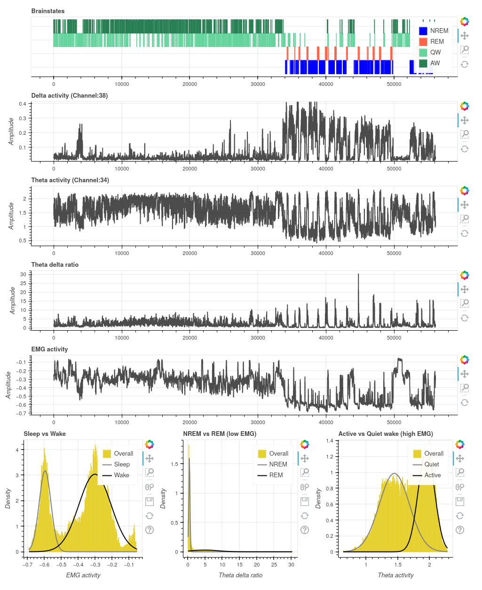

# Sleep loss diminishes hippocampal reactivation and replay
This repository conatains all the code used to analyze data and generate figures for Giri, Kinsky et al. (2024).  

The main code used is found in the `analysis_and_figure code` folder. The `misc_code` folder contains miscellaneous code, some of which is used for data visualization and quality control.  

The code used in this repository utilizes open-source code for neural data analysis in Python written by Bapun Giri, Nat Kinsky, and Pho Hale: https://github.com/diba-lab/NeuroPy.

### Interactive sleep scoring plots
Navigate to the `interactive_figures/sleep_scoring` folder and download a sleep scoring file (.html format) for a session of your choice.  

In this file you will find an interactive plot of sleep scoring for that session. An example sleep deprivation session is shown below. You can use the pan and zoom buttons to focus in on different periods of the recording. The x-axis of the top five plots is in seconds. PRE (home cage recording prior to track running) spans from 0 to ~2.5 hours (up to ~9000 seconds). MAZE spans from ~2.5 to 4 hours (~9000 sec to ~14,400 sec). Sleep Deprivation (SD) spans from 4 hours to 9 hours (~14,400 sec to ~32400 sec), and recovery sleep (RS) occurs from 9 hours until the end of the recording (~32400 sec on).  Non sleep deprivation (NSD) occurs from 2.5 hours to the end of recording (~9000 sec on).  

The bottom row of plots show histograms of EMG, theta/delta ratios, and theta activity for the whole session, demonstrating how sleep vs wake, NREM vs REM, and active wake (AW) vs. quiet wake (QW) were delineated.

 

### Interactive replay plot
Please download the .html file from this link (the file is too large to host on GitHub currently):
https://www.dropbox.com/s/e6nh5ucjsw0upgh/trajectory_replay_events.html?dl=0

In this file you will find an interactive plot as shown in the screenshot below:

Each panel depicts all PBE events from NSD (top) and SD (bottom) sessions. Each panel shows events that were categorized as continuous (brown dots) and non-continuous (blue dots). Hovering your mouse pointer on top a data point will show posterior probabililty matrix depicting probabilities of each location (along the yaxis) across time (along the xaxis).
